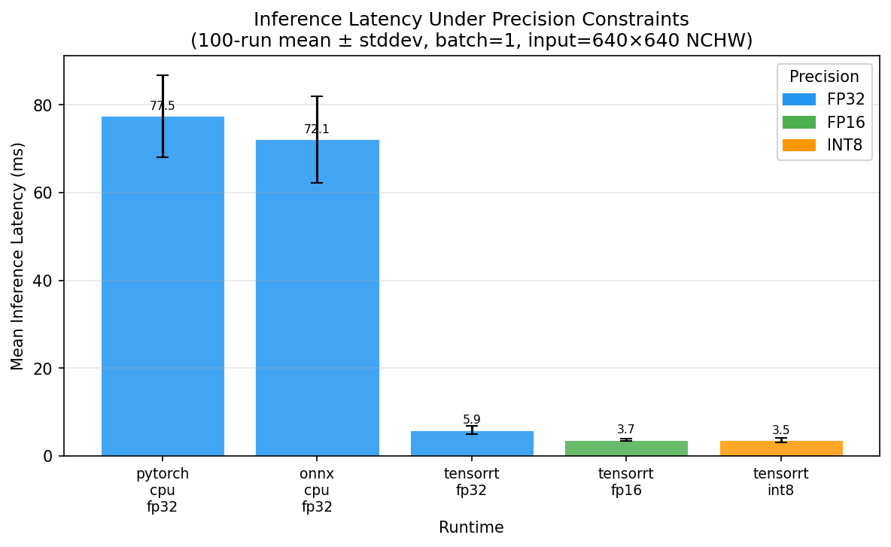
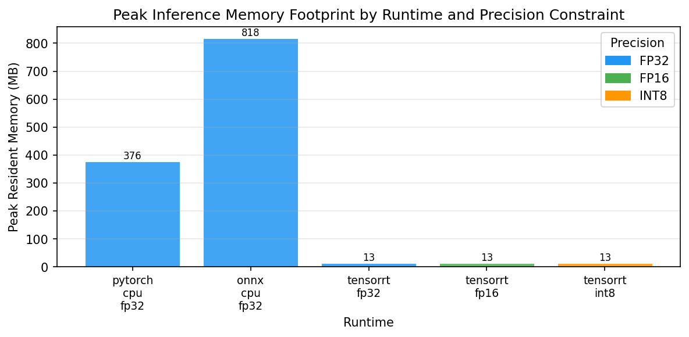
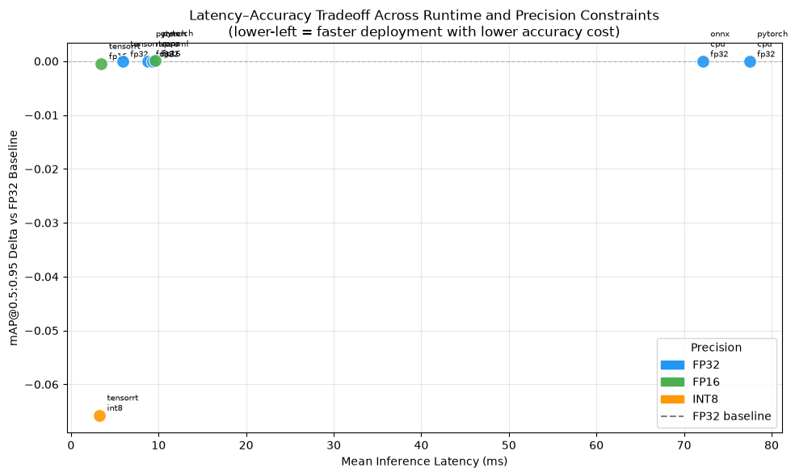

# Edge Inference Benchmark

Cross-runtime inference benchmarking for edge-constrained object detection.
Exports a pretrained YOLOv8n model to ONNX and evaluates it across PyTorch,
ONNX Runtime, and TensorRT at FP32 / FP16 / INT8 precision on real hardware.
The output is a **deployment decision framework** — not a model training study.

---

## Project Context

Selecting a runtime and precision for edge deployment requires measured evidence,
not heuristics. A 2× latency reduction at FP16 is only useful if the accuracy
cost is within the application's tolerance. This benchmark measures both
simultaneously so the tradeoff is visible before committing to a deployment
configuration.

**What is measured:**

| Metric | Protocol |
|---|---|
| Inference latency | 100 runs, 10 warmup discarded, `time.perf_counter()` |
| Latency distribution | mean, stddev, p95 (deployment-relevant upper bound) |
| Accuracy | mAP@0.5:0.95 on COCO val2017 (5 000 images, COCO standard) |
| Accuracy cost | mAP delta vs FP32 baseline — same runtime only |
| Memory footprint | Peak RSS during inference (psutil on CPU, `torch.cuda.max_memory_allocated` on GPU) |

---

## Runtime Matrix

| Runtime | Hardware | FP32 | FP16 | INT8 | Status |
|---|---|:---:|:---:|:---:|---|
| PyTorch CPU | Fedora CPU | ✓ | — | — | Active |
| ONNX Runtime CPU EP | Fedora CPU | ✓ | — | — | Active |
| ONNX Runtime + CoreML EP | Mac M4 Neural Engine | ✓ | ✓ | ✓ | Parked — hardware pending |
| PyTorch MPS | Mac M4 | ✓ | ✓ | — | Parked — hardware pending |
| TensorRT | Colab T4 GPU | ✓ | ✓ | ✓ | Notebook ready |

---

## Results

> Results are populated after running the benchmark suite. Charts are committed
> to `results/figures/` and embedded below once available.

### Inference Latency Under Precision Constraints



### Accuracy Degradation Under Quantisation Constraints

*(mAP delta relative to FP32 baseline, same runtime — negative = degradation)*

| Runtime | Precision | mAP@50:95 | mAP@50 | Δ vs FP32 |
|---|---|---|---|---|
| pytorch_cpu_fp32 | FP32 | — | — | — |
| onnx_cpu_fp32 | FP32 | — | — | — |
| tensorrt_fp32 | FP32 | — | — | 0.000 |
| tensorrt_fp16 | FP16 | — | — | — |
| tensorrt_int8 | INT8 | — | — | — |

### Memory Footprint by Runtime and Precision



### Latency–Accuracy Tradeoff (Deployment Decision Chart)



---

## Setup

### Prerequisites

- Python 3.11.x
- Fedora Linux (active) or Mac M4 (parked)
- COCO val2017 dataset (~1 GB images + annotations)
- YOLOv8n pretrained weights (`yolov8n.pt`)

### Environment

```bash
bash scripts/setup_environment.sh
```

Copy `.env.example` to `.env` and configure paths:

```bash
cp .env.example .env
# Edit COCO_DATA_DIR, MODEL_DIR, RESULTS_DIR as needed
```

### Data Download

```bash
bash scripts/download_data.sh
```

Downloads COCO val2017 images (~1 GB) and annotations. YOLOv8n weights are
downloaded automatically by `ultralytics` on first use.

### ONNX Export

```bash
python scripts/export_model.py
```

Exports `yolov8n.pt` to `models/yolov8n.onnx` (opset 17, static 640×640 shape,
`onnx-simplifier` post-processing). Validates output parity against the PyTorch
baseline within atol=1e-4.

---

## Running the Benchmark

```bash
# Full suite (all runtimes available on this machine)
python scripts/run_benchmark.py

# Specific runtime and precision
python scripts/run_benchmark.py --runtime pytorch_cpu --precision fp32

# With custom config
python scripts/run_benchmark.py --config configs/benchmark_config.yaml
```

Results are written to `results/` — one JSON file per runtime × precision
combination and a single `summary.csv` aggregating all runs.

### TensorRT (Colab T4)

Open `notebooks/tensorrt_colab.ipynb` in Google Colab with T4 GPU runtime.
Follow the prerequisites in Cell 1. The notebook is self-contained and
produces result JSON files that can be downloaded and merged into `results/`.

### Results Analysis

After all benchmark runs are complete:

```bash
jupyter notebook notebooks/results_analysis.ipynb
```

Produces the latency, memory, and tradeoff charts committed to `results/figures/`.

---

## Tests

```bash
# Unit tests — run before every commit
pytest tests/unit/

# Integration tests — require real model files
pytest tests/integration/ -m integration

# Full suite with coverage gate (80% minimum, 90%+ for benchmark modules)
pytest tests/ --cov=src --cov-fail-under=80
```

---

## Architecture

```
src/
├── export/          # YOLOv8n → ONNX export pipeline
├── data/            # COCO val2017 loader, letterbox preprocessing, INT8 calibration
├── runtimes/        # BaseRuntime ABC + PyTorch, ONNX Runtime, TensorRT implementations
├── benchmark/       # Latency profiler, mAP evaluator, memory profiler
├── results/         # Typed BenchmarkResult schema, JSON + CSV writer
└── utils/           # Device info capture, seed management

notebooks/
├── tensorrt_colab.ipynb    # TRT FP32/FP16/INT8 on Colab T4 (8 cells)
└── results_analysis.ipynb  # Post-benchmark charts and deployment analysis (7 cells)
```

**Preprocessing:** Letterbox resizing (aspect-ratio-preserving, gray-padded to
640×640) matches YOLOv8n's training convention. Plain bilinear resize to 640×640
distorts aspect ratio and degrades mAP systematically on non-square images.

**Coordinate mapping:** Model output bounding boxes are in 640×640 letterboxed
space. The `LetterboxMeta` dataclass carries scale and pad offsets per image so
boxes can be rescaled back to original image coordinates for correct COCO evaluation.

---

## Locked Parameters

| Parameter | Value | Reason |
|---|---|---|
| Model | YOLOv8n | Edge model class (3.2M params) |
| Dataset | COCO val2017, 80 classes | Reproducible standard baseline |
| Benchmark runs | 100, 10 warmup | p95 is deployment-relevant |
| INT8 calibration | 500 images, seed=42 | Reproducible, sufficient coverage |
| ONNX opset | 17 | TensorRT 8.6.x compatibility |
| Input shape | 640×640 NCHW, batch=1 | Fixed edge inference constraint |
| Timing | `time.perf_counter()` | Sub-millisecond resolution |

---

## Project Structure Notes

- `docs/specs/` — local-only authoritative specifications (gitignored)
- `results/` — generated output, not committed except `results/figures/`
- `data/` and `models/` — not committed; see `scripts/download_data.sh`
- Mac M4 paths are marked `# MAC_REQUIRED:` and implemented in `feature/mac-runtime` only when hardware is available
- TensorRT paths are marked `# COLAB_REQUIRED:` and implemented in `notebooks/tensorrt_colab.ipynb`
