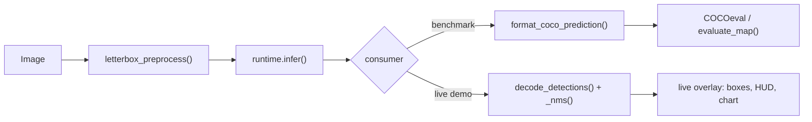
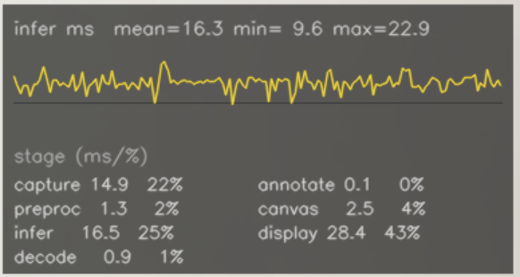

# edge-inference-benchmark

Cross-runtime inference benchmarking for edge-constrained object detection — YOLOv8n exported to ONNX and evaluated across PyTorch CPU, ONNX Runtime CPU EP, and TensorRT at FP32 / FP16 / INT8 precision, with full COCO val2017 mAP evaluation and a deployment decision framework derived from the measured data.

---

## What This Is

A systems engineering study of what happens between a trained perception model and a running system on constrained hardware. The same pretrained YOLOv8n model is exported once to ONNX (opset 17, static 640×640 input) and then evaluated across three inference runtimes — PyTorch CPU baseline, ONNX Runtime with CPU Execution Provider, and TensorRT on a Colab-hosted Tesla T4 — at FP32, FP16, and INT8 precision levels where the hardware supports them. Each runtime × precision combination runs under a fixed benchmark protocol: 100 timed inference passes, 10 warmup passes discarded, with mean, stddev, and p95 latency reported. Accuracy is measured as mAP@0.5:0.95 on the full 5,000-image COCO val2017 set, with delta computed relative to the FP32 baseline of the same runtime.

This is not a model training or accuracy improvement project. The YOLOv8n model is pretrained and fixed — the study begins after the model exists. What is measured is the deployment-relevant behaviour of the same model across different runtime and precision configurations: how latency changes, how accuracy changes, whether the latency distribution is stable enough to plan an SLA around, and what the memory footprint implies for hardware selection. These are the questions that determine whether a perception model is actually deployable on specific hardware, as opposed to merely functional.

### Pipeline Shape

One shared preprocessing/inference core, two consumers — a batch accuracy path and a live demo path — deliberately kept as separate implementations rather than one shared abstraction (see the Phase 2 section below for why).



---

## Results

> **Hardware coverage:** CPU benchmarks on Fedora Linux 42 (Intel Core Ultra 5 125H) — **Fedora hardware is no longer available to this project; these results are permanently frozen** (see mAP note below). TensorRT benchmarks ran on Colab-hosted Tesla T4 (Run 3, against the corrected preprocessing pipeline — `tensorrt` pinned to 10.16.1.11; CUDA/torch/onnxruntime moved with Colab's default image, see Pinned Versions below). Mac M5 (Apple M5 MacBook Air) benchmarks ran against the corrected preprocessing pipeline for PyTorch MPS (FP32, FP16) and ONNX Runtime + CoreML EP (FP32) — see [Runtime and Hardware Scope](#runtime-and-hardware-scope) for what's not implemented (CoreML EP FP16/INT8).

> **mAP note:** All mAP values are from this pipeline's evaluation (class-agnostic NMS, eval_conf_threshold=0.001). Published YOLOv8n baseline: 0.372 mAP@0.5:0.95 (Ultralytics, class-aware NMS) — see [Benchmark Methodology](#benchmark-methodology) for the gap composition. Mac M5 and Colab T4 (Run 3) FP32 numbers both reflect a fixed letterbox preprocessing bug (missing upscale clamp, affected ~1-in-5 COCO val2017 images) and agree closely (0.3576 both) despite independent hardware and runtime code. **Fedora CPU predates the fix and is permanently frozen** — hardware no longer available to re-measure (see footnote 9).

### Latency and Accuracy

| Runtime | Hardware | Precision | Mean latency | p95 latency | FPS (p95) | mAP@0.5:0.95 | mAP Δ vs FP32 |
|---|---|---|---:|---:|---:|---:|---:|
| PyTorch CPU | Fedora CPU | FP32 | 77.5 ms ⁵ | 95.4 ms ⁵ | 10.5 | 0.3595 ⁹ | baseline |
| ONNX Runtime CPU EP | Fedora CPU | FP32 | 72.1 ms ⁵ | 81.4 ms ⁵ | 12.3 | 0.3595 ⁹ | baseline |
| TensorRT | Colab T4 | FP32 | 5.88 ms ¹⁰ | 7.93 ms ¹⁰ | 126 | 0.3576 ¹⁰ | baseline |
| TensorRT | Colab T4 | FP16 | 3.44 ms ¹⁰ | 3.72 ms ¹⁰ | 269 | 0.3571 ¹⁰ | −0.0004 ¹ |
| TensorRT | Colab T4 | INT8 | 3.22 ms ¹⁰ | 3.55 ms ¹⁰ | 281 | 0.2919 ¹⁰ | **−0.0657** ¹³ |
| PyTorch MPS | Mac M5 | FP32 | 8.79 ms | 11.21 ms | 89 | 0.3576 ¹¹ | baseline |
| PyTorch MPS | Mac M5 | FP16 | 9.56 ms | 10.75 ms | 93 | 0.3577 ¹¹ | +0.0001 ⁶ |
| ONNX Runtime + CoreML EP | Mac M5 | FP32 | 9.34 ms | 9.93 ms | 101 | 0.3576 ¹¹ ⁸ | baseline |

¹ TRT FP16 mAP delta is below COCOeval measurement noise across all three Colab runs to date: essentially 0, +0.0000114 (Run 1), −0.0001388 (Run 2, pre-fix), −0.0004 (Run 3, post-fix). FP32 and FP16 are equivalent for all practical purposes at every measurement.

⁵ CPU numbers are from Run 3, a thermally throttled session. Mean latency ranged 1.7× across three sessions on identical hardware: PyTorch 51–88 ms, ONNX Runtime 43–72 ms. No single session is authoritative without CPU governor pinning; see [Emergent Findings](#emergent-findings) for the thermal characterisation. FPS derived from p95 latency.

⁶ Mac MPS FP16 mAP delta (+0.0000841, post-fix) is below COCOeval measurement noise — smaller than TRT's FP16 delta and consistent with FP16 having no measurable accuracy cost on this model at either GPU-class hardware target. FP16 here is a true full-precision cast (`.half()` on model and input), not autocast mixed precision — see `docs/issue-log/2026-08-07-mps-autocast-unsupported.md`.

⁸ `onnx_coreml_fp32`'s mAP deviates from the same-session PyTorch MPS FP32 result by 4.6×10⁻⁵ (post-fix; was 7.7×10⁻⁵ pre-fix) — smaller after the fix but still not conclusively within a re-established noise floor, since that floor hasn't been reconfirmed on the post-fix pipeline for Fedora/Colab. See `docs/benchmark-run-1-mac-findings.md`, Issue 3.

⁹ **Fedora CPU — measured before the letterbox upscale-clamp fix, permanently.** `letterbox_preprocess()` had no upscale clamp, diverging from the reference validator on ~1-in-5 COCO val2017 images (fixed in `src/data/coco_loader.py`; see Mac/Colab rows for the post-fix effect). Fedora hardware is no longer available to this project — these numbers cannot be regenerated, and are not adjusted by applying the Mac/Colab delta, which would be inference presented as measurement.

¹⁰ **Colab T4 — Run 3, measured against the corrected preprocessing.** FP32 mAP shifted −0.0019 and FP16 −0.0022 from pre-fix values — both matching Mac M5's shift from the day before almost exactly, corroborating that the fix's effect is a real, cross-runtime preprocessing artifact, not hardware- or runtime-specific. INT8 shifted −0.0256, roughly 13× larger than FP32/FP16 — not measurement noise or version drift (same TensorRT 10.16.1.11 confirmed via `hardware_info`); see footnote 13. Latency shifted modestly too (FP32 mean 5.91→5.88 ms), attributed to Colab's environment drifting between sessions — the same category of session-to-session variance as Fedora's CPU thermal envelope and Mac's machine-state variance documented elsewhere in this README.

¹¹ **Mac M5 — re-measured against the corrected preprocessing** (superseding the original session's numbers, which read 7.41/7.53/8.24 ms and ~0.3595/0.3594 mAP). mAP dropped ~0.0018–0.0019 across all three — see [Benchmark Methodology](#benchmark-methodology) for why removing the upscale bug moved mAP *away* from the published baseline. Latency also shifted (+1.1 to +2.0 ms per combination) — unrelated to the preprocessing fix (latency profiling uses a fixed synthetic input, not COCO images) and attributed to ordinary session-to-session machine-state variance, the same category as the Fedora CPU thermal variance documented in [Emergent Findings](#emergent-findings). Both Mac sessions confirmed to have run on the identical installed environment (package install timestamps checked directly), so this variance reflects genuine machine-state differences, not an environment confound.

**Corroboration:** Colab T4 Run 3 (footnote 10) shows the same-direction, similar-magnitude FP32 mAP shift (−0.0019, landing at the same 0.3576) on entirely different hardware and runtime code, against the identical fixed commit — independent evidence this is a genuine preprocessing effect, not a Mac- or MPS-specific artifact.

### Memory Footprint

| Runtime | Precision | Peak RSS |
|---|---|---|
| PyTorch CPU | FP32 | 376 MB ² |
| ONNX Runtime CPU EP | FP32 | ~460 MB ³ |
| TensorRT | FP32 / FP16 / INT8 | 12.7 MB (I/O buffers only) ⁴ |
| PyTorch MPS | FP32 | 419 MB |
| PyTorch MPS | FP16 | 874 MB ¹² |
| ONNX Runtime + CoreML EP | FP32 | 786 MB ⁷ |

² PyTorch CPU RSS confirmed stable to ±1.2% across three independent benchmark sessions (367–376 MB). Inference allocates +3.5 MB marginal memory above the loaded model; no allocation growth per call.

³ ONNX Runtime true steady-state footprint measured in isolation (Run 1, 460 MB). Sequential pipeline runs show 818 MB due to un-reclaimed heap from prior mAP evaluation — `peak_memory_delta_mb = 0.0` in those runs confirms zero marginal inference cost; the inflated RSS is entirely pre-existing allocation. True session footprint: ~460 MB.

⁴ The 12.7 MB reflects PyTorch-allocated I/O tensors (`d_input` + `d_output`). TRT allocates engine weights and activation workspace through its own cudaMalloc pools, which are invisible to `torch.cuda.max_memory_allocated()`. Estimated true VRAM: ~80–130 MB (FP16), ~150–250 MB (FP32), ~50–80 MB (INT8). This is a known measurement gap documented in `docs/benchmark-run-trt-2-findings.md`.

⁷ ONNX Runtime + CoreML EP's ~786 MB is notably higher than the CPU EP's ~460 MB for the same FP32 model. CoreML EP partitions the graph at load time (confirmed in logs: 11 partitions covering 221 of 233 nodes, with the remaining 12 nodes falling back to CPU EP) — the partition/fallback stitching and CoreML's own compiled-model representation both plausibly add overhead the single-EP CPU path doesn't incur; not decomposed further (see `docs/benchmark-run-1-mac-findings.md`, Observation C for the fuller picture, including a possible reduced-precision internal representation that hasn't been directly confirmed).

¹³ **INT8 mAP delta grew ~1.6× after the preprocessing fix: −0.042 → −0.0657 — the shift itself is ~13× larger than FP32/FP16's own shift from the same fix.** Not measurement noise or version drift (same TensorRT 10.16.1.11 confirmed via `hardware_info`). Plausible contributing mechanism, code-verified: the INT8 calibration set also runs through the fixed `letterbox_preprocess()`, so calibration statistics themselves shifted alongside the same eval-side effect FP32/FP16 see — giving INT8 a second channel the other precisions don't have. Not fully disambiguated from the alternative explanation (INT8 quantization error independently amplifying the same eval-side small-object effect) — would require diffing calibration-set activation statistics before/after the fix.

¹² PyTorch MPS FP16's 874 MB is contaminated by un-reclaimed heap from the preceding runtime's mAP evaluation within the same process — `peak_memory_delta_mb = 0.0` confirms zero marginal inference cost, same signature as ONNX Runtime CPU EP's contamination (footnote ³). Root cause: `run_benchmark.py`'s `gc.collect()` + `malloc_trim` cleanup between runtimes only works on Linux (`ctypes.cdll.LoadLibrary("libc.so.6")` — no such library on macOS, silently caught). Not fixed — no simple macOS equivalent exists; the true marginal cost is already visible via `delta_mb` regardless. PyTorch MPS FP32's 419 MB (first in the run sequence, least contaminated) is the more trustworthy steady-state estimate for this runtime. See `docs/issue-log/2026-09-09-letterbox-upscale-and-nms-docstring.md`.

### Latency–Accuracy Tradeoff


*Each point is one runtime × precision combination. X-axis: mean inference latency. Y-axis: mAP delta from FP32 baseline of the same runtime. The ideal operating region is bottom-left (fast and lossless). TRT FP16 sits at the efficient frontier. TRT INT8 offers a modest latency edge over FP16 (6.3% lower mean, 4.4% lower p95) but that ordering isn't stable session-to-session (see Emergent Findings); INT8's accuracy cost — 6.57 pp mAP, −18.4% relative — is what's stable, and dominates any latency edge at this scale. For any SLA- or accuracy-constrained deployment, FP16 is the operating point.*


---

## Benchmark Methodology

**Protocol:** 100 timed inference passes per runtime × precision combination, preceded by 10 discarded warmup passes. Warmup amortises JIT compilation, CUDA driver initialisation, and first-inference memory allocation — costs that do not recur on subsequent calls and would inflate the first measurement. Reporting mean + stddev + p95: mean characterises typical throughput; p95 characterises the latency percentile a deployed system must budget for under normal call variation. A deployment SLA is written against p95, not mean.

**Timing:** `time.perf_counter()` — not `time.time()`. `perf_counter` provides sub-millisecond monotonic resolution, independent of system clock adjustments. At the 2–8 ms latencies measured for TRT, a 1 ms step in `time.time()` would corrupt individual measurements.

**Batch size:** 1 throughout. Batch size > 1 amortises per-call kernel launch overhead across frames and does not represent the latency experienced by any individual inference call in a single-frame edge pipeline. All reported numbers reflect the deployment-relevant single-frame case.

**Accuracy evaluation:** mAP measured on the full COCO val2017 set (5,000 images). Detection confidence threshold for mAP evaluation: 0.001 (not the deployment threshold of 0.5). COCOeval constructs a precision-recall curve across all submitted confidence scores — submitting only high-confidence detections permanently truncates the curve and suppresses mAP by approximately 27% relative to the corrected measurement (0.263 vs 0.359). This was identified as the primary accuracy measurement error in Run 1 and corrected before subsequent runs. The `eval_conf_threshold` (0.001) and deployment `conf_threshold` (0.5) are separate parameters in `configs/benchmark_config.yaml`.

**mAP vs published baseline:** Mac M5 and Colab T4 (post-fix) both measure 0.3576 mAP@0.5:0.95 — full agreement on independent hardware and runtime code; Ultralytics reports 0.372 for YOLOv8n on COCO val2017. The residual gap (0.372 − 0.3576 ≈ 0.0144, ≈3.9% relative) is attributed to NMS methodology: this pipeline uses class-agnostic NMS (any two overlapping boxes are candidates for suppression regardless of class), while Ultralytics' validator uses per-class NMS by default — agnostic NMS suppresses some co-localised true positives in crowded multi-object scenes that per-class NMS would retain. This is an inference from two agreeing post-fix measurements, not a controlled ablation that isolates NMS alone (that would require re-running this pipeline's evaluator with per-class NMS substituted in). **Fedora CPU's canonical numbers in the table above are permanently frozen at their pre-fix values (0.3595) — Fedora hardware is no longer available to this project, so they cannot be re-measured**, and aren't directly comparable to the post-fix Mac/Colab figures for gap-composition purposes. Relative comparisons *within* the pre-fix Fedora numbers remain internally valid (the same code ran identically across every combination measured on that hardware).

**mAP delta:** Always computed relative to the FP32 baseline of the same runtime. TRT INT8 delta is relative to TRT FP32, not PyTorch CPU FP32. Cross-runtime mAP comparison conflates precision cost with runtime cost and is not reported.

**INT8 calibration:** 500 images sampled from COCO val2017 with fixed seed 42. The calibration set sampler is generic and was designed to serve both ONNX Runtime and TensorRT INT8 engines; only TRT INT8 calibration was executed. ONNX Runtime INT8 is not implemented (see [Runtime and Hardware Scope](#runtime-and-hardware-scope)). The calibration manifest is committed at `data/calibration/manifest.json` — the exact image set is reproducible without re-running the sampler. Note: using val2017 images for calibration introduces an estimated ~0.001–0.002 mAP optimism for INT8 (correct practice is COCO train2017, which requires an additional 18 GB download). This is documented in the manifest and does not change any qualitative conclusion in this study.

**Iterative methodology:** The benchmark pipeline was run eight times total across Fedora, Colab, and Mac M5 as measurement artefacts were identified and fixed. Canonical results use Run 3 for Fedora CPU (frozen pre-fix — hardware no longer available) and Run 3 for Colab TensorRT (post-fix) — independently-numbered per hardware target, not the same session.

---

## Runtime and Hardware Scope

| Runtime | Hardware | FP32 | FP16 | INT8 | Status |
|---|---|:---:|:---:|:---:|---|
| PyTorch CPU | Intel Core Ultra 5 125H (Fedora) | ✓ | — | — | Complete |
| ONNX Runtime CPU EP | Intel Core Ultra 5 125H (Fedora) | ✓ | — | — | Complete |
| TensorRT | Tesla T4 (Colab) | ✓ | ✓ | ✓ | Complete |
| PyTorch MPS | Apple M5 (Mac) | ✓ | ✓ | — | Complete |
| ONNX Runtime + CoreML EP | Apple M5 (Mac) | ✓ | — | — | FP32 complete; FP16/INT8 not implemented |

**Mac M5 / CoreML EP:** The study was designed with three hardware targets. The Mac was not available during the original benchmark window and became available later in the project (Apple M5 MacBook Air). PyTorch MPS (FP32, FP16) and ONNX Runtime + CoreML EP (FP32) are now benchmarked. Mac-specific code in `src/runtimes/onnx_runtime.py` and `src/runtimes/pytorch_runtime.py` (formerly marked `# MAC_REQUIRED:`) is active. TensorRT on Jetson and CoreML EP on Apple Silicon are architecturally comparable deployment scenarios in principle — both are vendor-specific accelerator paths — but a follow-up investigation found that this study's measurements do not confirm CoreML EP is engaging Apple's GPU or Neural Engine for this model: a repeated, multi-round `MLComputeUnits` comparison found no reproducible latency difference between requesting `CPUOnly`, `CPUAndGPU`, `CPUAndNeuralEngine`, or `ALL`, even though CoreML EP as a whole is genuinely ~4.4× faster than ONNX Runtime's generic `CPUExecutionProvider` (attributable to Apple's optimized Accelerate/BNNS CPU kernels, confirmed via a dedicated control). Read as "a fast, CPU-optimized ONNX Runtime path on Apple Silicon," not as confirmed Neural Engine inference. Direct `powermetrics` measurement confirms this further: `CPUOnly` — documented by Apple as excluding the GPU/Neural Engine — shows the same elevated ANE power draw (~857 mW) as every other `MLComputeUnits` setting, while a genuine non-CoreML floor (idle machine, or plain `CPUExecutionProvider`) reads a clean 0 mW. So `CPUOnly` isn't actually isolating the Neural Engine, and the argument that its exclusion proves "no contribution" doesn't hold — the latency-null result itself is unaffected. The sustained draw points to likely real, if partial, Neural Engine engagement (op-level compute not separately confirmed). FP16 on MPS uses explicit `.half()` casting rather than `torch.autocast`, which does not support `device_type="mps"` on the pinned `torch==2.3.1`.

**TensorRT on Apple Silicon:** TensorRT does not run on Apple Silicon. This is an architecture boundary, not a project limitation. The study benchmarks across hardware classes intentionally: CPU-only baseline, NVIDIA GPU (T4), and Apple Silicon (M5). The absence of TensorRT on Mac is consistent with this design.

---

## Emergent Findings

These findings were not known before the benchmark ran. Each is supported by specific numbers across multiple sessions.

**Hardware acceleration is not an optimisation at this resolution — it is a prerequisite.** TRT FP16 on a Colab T4 delivers 3.44 ms mean / 3.72 ms p95 at 269 FPS (at p95) ¹⁰. ONNX Runtime CPU EP on a Core Ultra 5 125H delivers 72 ms mean / 81 ms p95 at 12.3 FPS (at p95). The gap is roughly 12–26× at mean (using the three-session Fedora thermal envelope, footnote 5, against TRT FP16's Run 3 mean) and 22–26× at p95 (using the two canonical Fedora p95 figures against TRT FP16's Run 3 p95), depending on CPU thermal state (cold-start Turbo Boost to sustained throttle). For 640×640 YOLOv8n inference, the relevant deployment question is not which CPU runtime to prefer — both fail the 30 FPS real-time threshold at every observed thermal state — but whether CPU is the right hardware class at all.

**Naive mAP evaluation produces plausible-looking wrong numbers and does not crash.** Run 1 measured mAP@0.5:0.95 = 0.263 across all runtimes. The correct value is 0.359. The cause: using the deployment confidence threshold (conf=0.5) for COCOeval detection submission. COCOeval constructs a precision-recall curve from all submitted detections; pre-filtering to conf=0.5 permanently discards the lower half of that curve before COCOeval sees it. The result is a plausible number — not NaN, not zero, in a reasonable range for a detection model — that is completely wrong. The fix required separating `eval_conf_threshold` (0.001) from `conf_threshold` (0.5) at the config level. Any pipeline that uses a deployment-level threshold for mAP evaluation will reproduce this error silently.

**INT8 tail latency on shared Colab GPU infrastructure is not predictable across sessions — the accuracy cost, not the latency ordering, is what's stable.** Across three TensorRT sessions, INT8's p95 ordering relative to FP16 flipped direction each time (faster in Run 1, 17% slower in Run 2, faster again in Run 3), and no two of those three sessions ran under a matching software stack (onnxruntime, numpy, and — Run 3 — Python and torch all differ too), so the variation isn't attributable to a single stable precision-dependent mechanism. What is stable across all three: the accuracy cost. INT8's mAP@0.5:0.95 penalty is −0.0657 post-fix (−18.4% relative, see footnote 13) — the dominant, non-noise-level factor against INT8 regardless of which way the latency ordering falls in a given session. Deployment guidance: don't assume INT8's raw speed advantage survives to p95 without measuring it directly on the target hardware and software stack.

**CPU benchmark numbers from a single session on unpinned hardware are not authoritative.** PyTorch CPU FP32 mean latency across three sessions on identical hardware and code: 51 ms, 77.5 ms, 88 ms — a 1.7× range with no code change between sessions. ONNX Runtime CPU EP ranged 43–72 ms mean across the same sessions. The variation is machine thermal state, not randomness: cold-start Turbo Boost, partial throttle under prior load, and sustained throttle during a long inference run occupy distinct regions of the distribution. The three-session envelope is the honest characterisation. Reporting any single session's number — whether the fastest or the slowest — as representative would be misleading in either direction.

**FP32 → FP16 on TensorRT has no measurable accuracy cost.** As of Run 3 (post-fix): TRT FP16 mAP = 0.3571 vs FP32 = 0.3576; the −0.0004 delta is below COCOeval summation noise, consistent with pre-fix Run 1/Run 2 (−0.0001, sign-reversing) — see footnote 1. Latency drops 41% at mean, 53% at p95 (Run 3: 5.88→3.44 ms, 7.93→3.72 ms). FP32 is a dominated option wherever Tensor Core FP16 execution is available. TRT FP32 shows meaningful session-to-session latency variance across every run measured (CV 16.6%–25.6% across three sessions) on shared Colab infrastructure — the reported p95 = 7.93 ms carries this uncertainty; the specific cause (e.g. GPU clock behavior) isn't confirmed, since no two of the three sessions ran matching software stacks.

**The ORT vs. PyTorch speed advantage is 7–14% — the 2× figure from Run 1 was a thermally-contaminated measurement.** Run 1 measured ORT at 42.7 ms vs PyTorch at 87.7 ms (2.05×), but PyTorch had hit the thermal throttle floor while ORT ran into a brief recovery window between tests. Under matched thermal conditions the ratio is 1.07–1.14×.

**ONNX export equivalence held to 7 significant figures under a demanding test.** At eval_conf_threshold=0.001, near-marginal anchor outputs (confidence 0.001–0.010) are in play where the 9.77×10⁻⁴ max tensor deviation is on the order of the threshold itself — any systematic activation bias would submit a different detection set. mAP agreed to the seventh decimal across 42 million evaluated anchor outputs.

**Apple Silicon is competitive with a discrete NVIDIA GPU for this model class — and FP16 provides no latency benefit on MPS, unlike TensorRT.** PyTorch MPS FP32 delivers 8.79 ms mean / 11.21 ms p95 (89 FPS at p95) ¹¹ — faster than Fedora's still pre-fix, permanently-frozen CPU FP32 (77.5 ms ⁹) and within 1.5× of TRT FP32 on a discrete T4 GPU (5.88 ms, Run 3's post-fix figure). Both MPS and TRT figures are post-fix, measured against the identical fixed commit — a directly comparable pair, unlike the Fedora figure. ONNX Runtime + CoreML EP FP32 is slightly slower at 9.34 ms mean. A follow-up audit investigated why a dedicated accelerator path would be slower than a generic GPU-compute path (MPS) and found the graph-partitioning explanation incomplete: a repeated, multi-round test comparing CoreML EP's `MLComputeUnits` settings (`CPUOnly` vs `CPUAndGPU` vs `CPUAndNeuralEngine` vs `ALL`) found no reproducible latency difference between any of them (Kruskal-Wallis p=0.57), even though CoreML EP as a whole is genuinely ~4.4× faster than ONNX Runtime's generic CPU execution provider. The likely explanation is that CoreML EP's advantage here comes from Apple's optimized Accelerate/BNNS CPU kernels, not from Neural Engine or GPU engagement. Direct `powermetrics` power-draw measurement confirms this further: `CPUOnly` shows the same elevated ANE power draw (~857 mW) as every other setting, while a genuine non-CoreML floor reads 0 mW, so `CPUOnly` isn't actually excluding the Neural Engine as documented. The latency result stands; the reasoning that `CPUOnly` proves "no Neural Engine involvement" doesn't. Sustained ~850 mW points to likely real, if partial, engagement (which operations, not established). Scoped to this exported graph (12/233 nodes always fall back to CPU regardless of compute-unit setting) and this model's small compute profile. Unlike TensorRT, where FP16 cuts mean latency 38% relative to FP32, MPS FP16 shows no latency improvement (9.56 ms vs 8.79 ms mean — if anything slower) despite an identical accuracy profile (mAP delta +0.0000841, noise-level, smaller than TRT's own FP16 delta). For a nano-class model at 640×640, Apple Silicon's Metal shader path does not appear to be the same kind of throughput bottleneck NVIDIA's Tensor Cores relieve — FP16 casting overhead may offset any compute-side gain at this scale. Not further decomposed in this study (no Metal-level profiling).

---

## Deployment Decision Framework

These framing questions emerge from the benchmark data. They do not prescribe a deployment choice for any specific system — they structure what evidence is available and what gaps remain.

**For latency-constrained GPU inference (e.g., robotics, edge compute with NVIDIA hardware):**
TRT FP16 is the reference operating point. Mean latency 3.44 ms, p95 3.72 ms, 269 FPS (at p95), mAP@0.5:0.95 = 0.3571 — statistically indistinguishable from FP32 accuracy. INT8's latency edge over FP16 is small and its ordering session-dependent (see Emergent Findings) — 6.3% lower mean at best, and that ordering has reversed between sessions before. What doesn't reverse is the accuracy cost: **−6.57 pp mAP (−18.4% relative)** — see footnote 13 for the plausible calibration-pathway mechanism. NVIDIA's own TRT deployment guidance classifies INT8 as appropriate when the accuracy cost is below 1 pp absolute; at −6.57 pp, this study's empirical result exceeds that threshold by roughly **6.6×**. For YOLOv8 nano-class models, INT8 quantisation carries more activation sensitivity per parameter than larger models — the accuracy cost is not hypothetical. Unless the target application can tolerate an ~18% relative mAP reduction, FP16 is the dominant choice — and given the session-dependent latency ordering, INT8's case as a *faster* option is no longer safe to assume either.

**For CPU-only edge deployment (no discrete GPU, passively cooled):**
Neither PyTorch CPU nor ONNX Runtime CPU EP delivers real-time inference at 640×640 FP32 on a modern laptop-class CPU under sustained load. ONNX Runtime CPU EP reduces latency 7–14% relative to PyTorch (state-dependent) at the cost of ~85 MB additional steady-state RSS (~460 MB vs ~376 MB). On a device with 512 MB available RAM, ONNX Runtime CPU EP is viable with narrow headroom; on 256 MB, neither runtime is viable in FP32 at this resolution. For real-time CPU inference at 640×640, quantisation (INT8) or resolution reduction (416×416 or lower) would be required — neither is benchmarked in this study at the CPU level. The CPU results establish the baseline; hardware acceleration (Neural Engine, GPU) is required for real-time deployment at this resolution.

**For systems with hard accuracy constraints:**
The INT8 mAP@0.5:0.95 penalty on TRT for YOLOv8n is −0.0657 absolute (−18.4% relative) — not measurement noise (same TensorRT 10.16.1.11 confirmed via `hardware_info`; see footnote 13 for the calibration-path mechanism). This corresponds to a meaningful reduction in detection recall across COCO's 80 classes, concentrated at smaller objects and lower-confidence predictions — categories where a nano-class model already operates near its detection floor. In any system where a missed detection has physical consequences, INT8 deployment of YOLOv8n should be evaluated against per-class recall requirements, not assumed safe on the basis of supported precision modes.

**For memory-budgeted deployment planning:**
CPU memory footprints are characterised: PyTorch CPU FP32 = 376 MB (stable to ±1.2% across three sessions), ONNX Runtime CPU EP = ~460 MB (isolated measurement). TRT VRAM is not characterised — the 12.7 MB figure in the result schema reflects PyTorch I/O tensor allocation only. Before using these results to size GPU memory on embedded targets (Jetson Orin, Xavier), nvidia-smi VRAM measurement before/after engine load must be added to the TRT benchmark cell.

**For Apple Silicon / on-device edge deployment (products built on Apple hardware — iOS/macOS-embedded perception, robotics with an Apple SoC):**
PyTorch MPS FP32 (8.79 ms mean, 89 FPS at p95) and ONNX Runtime + CoreML EP FP32 (9.34 ms mean, 101 FPS at p95) both clear real-time thresholds comfortably at this resolution, with mAP@0.5:0.95 = 0.3576 for both ¹¹ — matching Colab T4's post-fix FP32 figure exactly (see footnote 10) and sitting below Fedora's still-frozen pre-fix 0.3595 for the reason explained in [Benchmark Methodology](#benchmark-methodology), not because Mac/Colab underperform Fedora. Unlike the NVIDIA path, FP16 provides no measured latency benefit on MPS in this study (9.56 ms mean, if anything slower than FP32) — FP32 is the simpler operating point on Apple Silicon at this model size unless a specific memory or power constraint favours FP16's smaller weight footprint. INT8 on this hardware path is not implemented (see Runtime and Hardware Scope), so a deployment requiring INT8-class throughput on Apple Silicon cannot be evaluated from this study's data. CoreML EP's higher steady-state memory (786 MB vs MPS FP32's 419 MB for the identical model) should factor into device memory budgeting alongside the raw latency numbers; a deployment choosing between PyTorch MPS and ONNX Runtime + CoreML EP on Apple Silicon should currently default to PyTorch MPS unless CoreML-specific tooling (Core ML model deployment on iOS, for instance) is otherwise required — this study's own measurements do not confirm CoreML EP is deriving a Neural-Engine-specific benefit over MPS's direct GPU path (see Runtime and Hardware Scope). Scope note: this is specific to YOLOv8n's small, few-GFLOPs compute profile at batch=1 and to this ONNX export's graph (12 of 233 nodes fall back to CPU regardless of compute-unit setting) — it should not be generalized to larger models or fully-supported graphs, where fixed accelerator dispatch overhead is a smaller fraction of total compute time and the calculus may differ.

---

## Phase 2 — Live Demo

`scripts/webcam_demo.py` runs the same runtime/precision combination benchmarked above (ONNX Runtime + CoreML EP, Apple M5, FP32) live against a webcam feed — the deployment claim made visible, not just tabulated. Per-frame inference latency and a rolling 30-frame FPS average are overlaid on every frame, so the constraint stays visible for the duration of the demo rather than being a single quoted number.

The overlay intentionally does not claim things this study didn't establish: it labels precision "FP32", not "FP16" (CoreML EP FP16/INT8 quantisation is not implemented — see Runtime and Hardware Scope), and carries no "Neural Engine Accelerated" annotation. That omission decision still holds, though the justification is now more specific than the original latency-only test: direct `powermetrics` measurement (see Runtime and Hardware Scope) found likely real, if partial, Neural Engine engagement, but no deployment-relevant latency benefit from it — not the clean "no engagement" the demo originally assumed. Either way, asserting "accelerated" on screen isn't something this study's data supports. A demo overlay is exactly the kind of place an unverified claim quietly survives.

**Live inference-time chart + stage-timing table.** A rolling chart of per-frame inference latency, plus a live breakdown of where the rest of the frame's time goes, both drawn directly on the feed:



The jitter in that chart is real and explained, not noise: this study's own isolated benchmark reports 9.34 ms mean for this exact runtime/precision (see Results table above) — a tight, back-to-back timing loop with no gaps between calls. The live demo measures 14.79 ms mean, 58%+ higher, under the identical model and hardware. The cause is a measured CPU frequency/power-state effect, not a bug: the CPU downclocks during the ~50 ms of idle time between inference calls in a live capture loop (camera read, decode, draw, display), and pays a real "cold start" tax ramping back up each time — directly confirmed with real CPU frequency counters (active clock speed measurably lower after a longer idle gap, tracking the latency increase). A tight-loop benchmark never sees this gap; a live camera loop always has one. The general lesson: an isolated, sustained-throughput benchmark number is real and correct for what it measures, but doesn't by itself predict single-call latency under a bursty, real-world access pattern — worth knowing before sizing a deployment SLA off a benchmark table alone.

```bash
python scripts/webcam_demo.py                        # default: models/yolov8n.onnx, camera 0
python scripts/webcam_demo.py --conf 0.4              # lower confidence threshold, more boxes
python scripts/webcam_demo.py --provider CPUExecutionProvider  # fallback off CoreML EP
```

Not Apple-Silicon-only: `OnnxRuntime` falls back to `CPUExecutionProvider` automatically on any platform without CoreML EP, and this script's own history proves it — the original version ran on Fedora Linux for months before Mac M5 hardware existed. `CoreMLExecutionProvider` (the default) is the one Apple-Silicon-specific piece; everywhere else, it's a CPU-bound live demo like any other.

Detection decoding (box decode, letterbox coordinate reversal) reuses the same `letterbox_preprocess` and `OnnxRuntime` primitives as the benchmark pipeline. NMS ports the same algorithm as the benchmark's own accuracy evaluator but is a deliberately separate, independently unit-tested copy — not a shared helper — and has since diverged from it on purpose: the demo's NMS is class-aware (a detection can only suppress another of the same class), while the benchmark's stays class-agnostic to match the accuracy-evaluation reference it's measured against. Two different jobs, two different correct answers; `tests/unit/test_webcam_demo.py` covers the demo's copy directly, independent of `scripts/*` being excluded from the coverage gate — this logic has the same silent-wrong-output failure mode as the benchmark's own accuracy evaluator.

---

## Reproduction

```bash
# Environment — creates conda env with pinned dependencies
bash scripts/setup_environment.sh

# COCO val2017 images and annotations (~1 GB)
bash scripts/download_data.sh

# Export YOLOv8n → ONNX (opset 17, dynamic=False, simplify=True, parity validated)
python scripts/export_model.py

# CPU benchmark suite (PyTorch CPU + ONNX Runtime CPU EP)
python scripts/run_benchmark.py

# Mac benchmark suite (PyTorch MPS + ONNX Runtime CoreML EP) — run on Apple Silicon
# --runtime/--precision filters target only these, without re-running (and
# overwriting) the canonical Fedora CPU result files under the same filenames
python scripts/run_benchmark.py --runtime pytorch_mps --runtime onnx_coreml

# TensorRT benchmark — self-contained, run on Colab T4
# notebooks/tensorrt_colab.ipynb

# Post-benchmark analysis and figure generation
jupyter notebook notebooks/results_analysis.ipynb
```

**Pinned versions — Fedora:** Python 3.11.11, PyTorch 2.3.1+cpu, ONNX Runtime 1.18.1, numpy 1.26.4, ultralytics 8.2.103.

**Pinned versions — Colab T4 (Run 2 environment):** TensorRT 10.16.1.11, CUDA 12.8, PyTorch 2.10.0+cu128, ONNX Runtime 1.26.0, numpy 2.0.2, Python 3.12.13.

**Pinned versions — Colab T4 (Run 3 environment, canonical):** TensorRT 10.16.1.11 (explicitly re-pinned mid-project after Colab's default image drifted to 11.3.0.99, which removed the precision-flag API this notebook depends on — see `docs/issue-log/2026-09-11-colab-trt-version-pin.md`), CUDA 12.8, PyTorch 2.11.0+cu128, ONNX Runtime 1.30.0, numpy 2.1.3, Python 3.13.15. Everything except the explicitly-pinned `tensorrt` (exact) and `onnx` (now range-pinned, see `requirements-colab.txt`) moved with Colab's default image between Run 2 and Run 3 — expected and documented, not a reproducibility concern for TensorRT itself since that dependency is pinned exact.

The "CUDA 12.8" figure quoted here and elsewhere in this README (Run 2's pinned versions above, and the file footer) is `torch.version.cuda` — the toolkit tag PyTorch's own wheel was built against, not an independently-confirmed host driver version. See `docs/issue-log/2026-09-10-colab-onnx-wheel-build-failure.md` for the full explanation.

**Pinned versions — Mac M5 (actual benchmark environment):** Python 3.11.15, PyTorch 2.3.1, ONNX Runtime 1.18.1, numpy 1.26.4, ultralytics 8.2.103, coremltools 7.2. Same torch/onnxruntime/numpy/ultralytics pins as Fedora, per the project's cross-environment version-parity requirement. Note: `coremltools==7.2` has not been officially tested against `torch==2.3.1` upstream (most recently tested against 2.2.0) — no issues observed in this study, flagged for awareness.

**INT8 calibration:** Manifest committed at `data/calibration/manifest.json` — exact 500-image set (seed 42, COCO val2017) is reproducible without re-running the sampler.

**Tests:**

```bash
pytest tests/unit/                             # 238 tests — run before every commit
pytest tests/integration/                      # End-to-end pipeline validation
pytest tests/ --cov=src --cov-fail-under=80    # 80% floor; 90%+ on benchmark modules
```

---

## Project Structure

```
edge-inference-benchmark/
├── configs/
│   └── benchmark_config.yaml         # All tunable parameters — eval and deployment
│                                     # thresholds are separate; no magic numbers in src/
├── src/
│   ├── runtimes/
│   │   ├── base_runtime.py           # Abstract interface — name, load, infer, warmup
│   │   ├── pytorch_runtime.py        # CPU + MPS (FP32/FP16, explicit .half() cast) — active
│   │   ├── onnx_runtime.py           # CPU EP + CoreML EP (FP32) — active; FP16/INT8 not built
│   │   └── tensorrt_runtime.py       # TRT engine execution (Colab only)
│   ├── benchmark/
│   │   ├── latency_profiler.py       # 100 runs, 10 warmup, perf_counter, p95
│   │   ├── accuracy_evaluator.py     # mAP@0.5:0.95 on full COCO val2017
│   │   └── memory_profiler.py        # RSS + delta_mb; VRAM via torch.cuda
│   ├── data/
│   │   ├── coco_loader.py            # Letterbox preprocessing, COCO ID mapping
│   │   └── calibration_set.py        # 500-image INT8 calibration set, seed=42
│   ├── export/
│   │   └── onnx_exporter.py          # YOLOv8 → ONNX with parity validation
│   └── results/
│       ├── result_schema.py          # BenchmarkResult dataclass — full field set
│       └── result_writer.py          # JSON (one per run) + summary CSV
├── notebooks/
│   ├── tensorrt_colab.ipynb          # Self-contained TRT FP32/FP16/INT8 on Colab T4
│   └── results_analysis.ipynb        # Loads canonical JSON files, produces figures
├── results/
│   └── figures/                      # Committed — latency_comparison, memory_footprint,
│                                     # tradeoff_scatter (PNG)
└── tests/
    ├── unit/                         # One test file per source module (227 tests)
    └── integration/                  # Pipeline validation from input to result schema
```

---

*Benchmark environment: Fedora Linux 42 (Intel Core Ultra 5 125H, CPU-only) for PyTorch and ONNX Runtime; Google Colab Tesla T4 (TRT 10.16.1.11, CUDA 12.8) for TensorRT; Apple M5 MacBook Air for PyTorch MPS and ONNX Runtime + CoreML EP. Model: YOLOv8n (Ultralytics, pretrained on COCO, 3.2M parameters). Dataset: COCO val2017, 5,000 images, 80 classes.*
